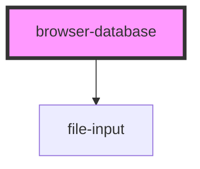

# browser-database

<!-- Auto Generated Below -->

## Properties

| Property      | Attribute       | Description                                                            | Type      | Default                 |
| ------------- | --------------- | ---------------------------------------------------------------------- | --------- | ----------------------- |
| `accept`      | `accept`        | String of comma-separated file types. All types allowed by default     | `string`  | `''`                    |
| `dbName`      | `db-name`       | Name of the database                                                   | `string`  | `'file-store-database'` |
| `dbStoreName` | `db-store-name` | Name of the database store                                             | `string`  | `'file-store'`          |
| `geotag`      | `geotag`        | If true, geolocation info for files will be saved in the file manifest | `boolean` | `false`                 |
| `icon`        | `icon`          | Materialize icon to use for the component if visible                   | `string`  | `'folder'`              |
| `theme`       | `theme`         | Sets dark or light theme                                               | `string`  | `'dark'`                |
| `timetag`     | `timetag`       | If true, a timestamp for files will be saved in the file manifest      | `boolean` | `false`                 |
| `visible`     | `visible`       | Determines visibility of component                                     | `boolean` | `false`                 |

## Events

| Event         | Description | Type                           |
| ------------- | ----------- | ------------------------------ |
| `modalClosed` |             | `CustomEvent<BrowserDatabase>` |
| `modalOpened` |             | `CustomEvent<BrowserDatabase>` |

## Methods

### `close() => Promise<void>`

#### Returns

Type: `Promise<void>`

### `delete(key: any) => Promise<any>`

#### Returns

Type: `Promise<any>`

### `deleteDatabase() => Promise<boolean>`

#### Returns

Type: `Promise<boolean>`

### `get(key: any) => Promise<any>`

#### Returns

Type: `Promise<any>`

### `getManifest() => Promise<any>`

#### Returns

Type: `Promise<any>`

### `keys() => Promise<any>`

#### Returns

Type: `Promise<any>`

### `open() => Promise<void>`

#### Returns

Type: `Promise<void>`

### `set(key: any, val: any) => Promise<any>`

#### Returns

Type: `Promise<any>`

## Dependencies

### Depends on

- [file-input](../file-input)

### Graph

----------------------------------------------

*Built with [StencilJS](https://stenciljs.com/)*
