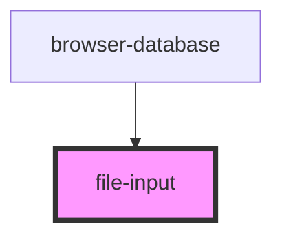

# my-component

<!-- Auto Generated Below -->

## Properties

| Property  | Attribute | Description                                                        | Type      | Default |
| --------- | --------- | ------------------------------------------------------------------ | --------- | ------- |
| `accept`  | `accept`  | String of comma-separated file types. All types allowed by default | `string`  | `''`    |
| `icon`    | `icon`    | Sets the materialize icon to use                                   | `string`  | `'add'` |
| `visible` | `visible` | Determines if input is visible                                     | `boolean` | `false` |

## Events

| Event         | Description | Type                |
| ------------- | ----------- | ------------------- |
| `inputChange` |             | `CustomEvent<File>` |

## Dependencies

### Used by

 - [browser-database](../browser-database)

### Graph

----------------------------------------------

*Built with [StencilJS](https://stenciljs.com/)*
